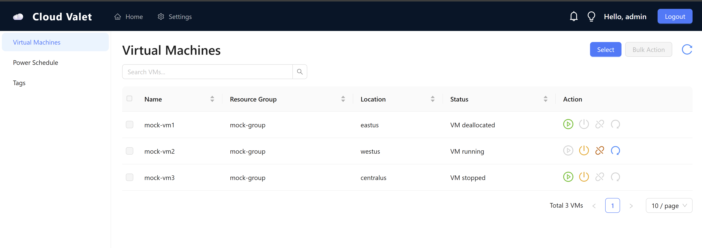
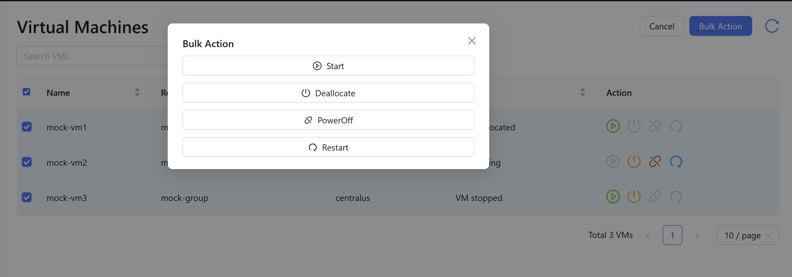
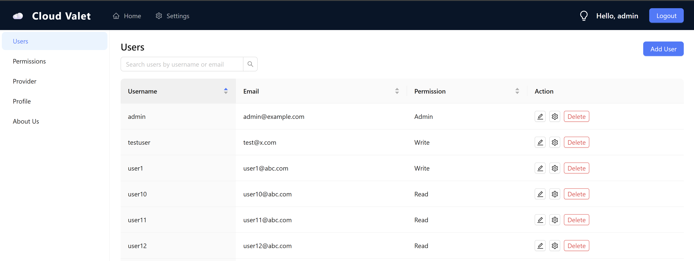
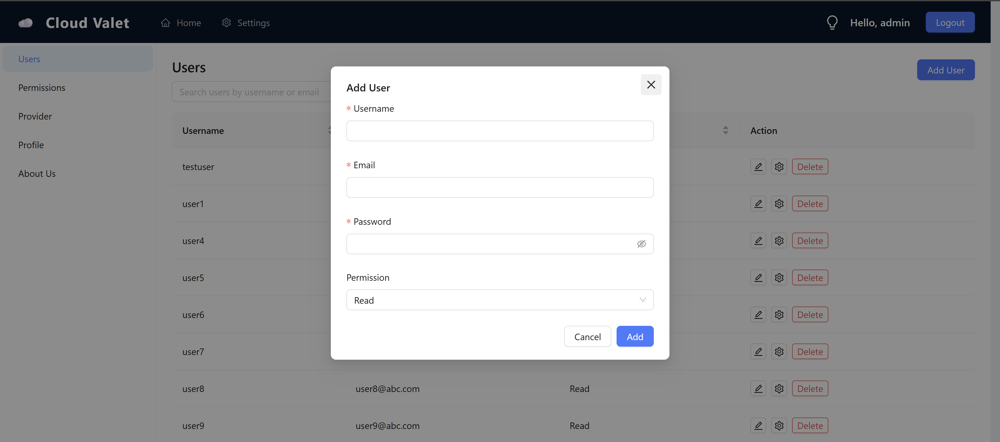
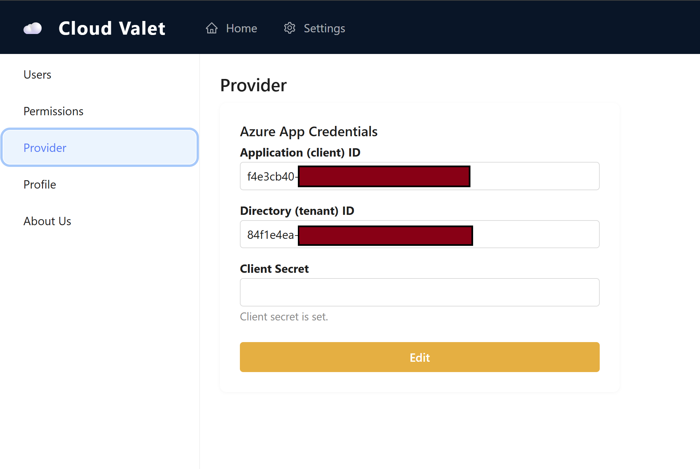

> **Note:** This project is in active development. Not all features are available yet. Contributions and feedback are welcome!

# Cloud Valet

[](https://github.com/patilk234/cloud-valet/actions/workflows/ci.yml)

## Product Description

**Cloud Valet** is an open source implementation of cloud virtual machine power management, designed to help organizations save costs by automatically managing the power state of their cloud VMs. Inspired by commercial solutions like ParkMyCloud, Cloud Valet enables you to schedule, start, stop, and optimize your cloud infrastructure across multiple providers (Azure, AWS, GCP, Heroku, and more) — all with full transparency and control.

With Cloud Valet, you can:
- Automatically stop or start VMs based on schedules or policies
- Reduce unnecessary cloud spend by parking idle resources
- Manage users, groups, tags, and VM metadata
- Integrate with your existing cloud accounts and workflows

Cloud Valet is fully open source, extensible, and designed for teams who want to bring cloud cost optimization in-house.

## Features
- FastAPI backend
- PostgreSQL database (Dockerized)
- SQLAlchemy async ORM
- User, Group, Tag, VM models

## Getting Started

1. Build and start the stack:

```bash
docker-compose up --build
```

2. The API will be available at [http://localhost:8000](http://localhost:8000)

3. The database will be available at `localhost:5432` (user: cloudvalet, pass: cloudvaletpass, db: cloudvaletdb)

## Project Structure

- `app/` - FastAPI app code
  - `main.py` - FastAPI entrypoint
  - `db.py` - Database connection
  - `models.py` - ORM models
  - `requirements.txt` - Python dependencies
- `docker-compose.yml` - Multi-container setup
- `app/Dockerfile` - FastAPI app container

## Running Tests

### Backend

```bash
cd Cloud-Valet/app
pip install -r requirements.txt
pytest
```
- The backend uses environment variables from `.env` (not committed). For CI, variables like `MOCK_AZURE` are set in `.github/workflows/ci.yml`.

### Frontend

```bash
cd cloud-valet-frontend
npm install
npm test
```
- Frontend tests use a global setup file `src/setupTests.js` to mock `window.matchMedia` for Ant Design compatibility.
- The project uses `@testing-library/jest-dom` for improved assertions.

All tests are run automatically in CI on every pull request.

## Environment Variables
- Copy `.env.example` to `.env` in `Cloud-Valet/app` for local development.
- For CI/CD, environment variables are set in the workflow YAML and not read from `.env`.

## Next Steps
- Add API endpoints for user/group/tag/vm management
- Implement authentication
- Add scheduling logic
- Integrate with Azure, AWS, GCP, Heroku
- Bulk Action and Select buttons are now visually aligned in the Dashboard for a cleaner UI.

## Screenshots

| Dashboard View | Bulk Action Modal | User Management | Add User | Credential Provider |
|:-------------:|:----------------:|:---------------:|:--------:|:-------------------:|
|  |  |  |  |  |

